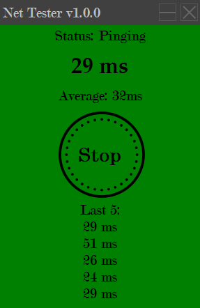

# Net Tester
Prosta aplikacja wyświetlająca aktualne opóźnienie połączenia internetowego w ms.
Program zapisuje historię wyników do plików w folderze tests.

## Instalacja

Aplikację należy pobrać i wypakować w dowolnym folderze. Po uruchomieniu i kliknięciu przycisku Start aplikacja zacznie wyświetlać aktualne opóźnienie.

